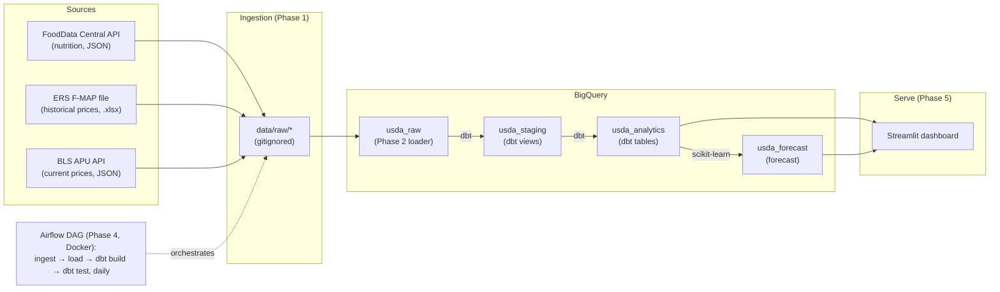

# USDA Food Price & Nutrition Pipeline

[](https://github.com/Mikepelgar/USDA-Food-Price/actions/workflows/ci.yml)

An end-to-end, free-tier data pipeline that ingests U.S. food **price** and **nutrition** data
from public USDA + BLS sources, lands it in a cloud warehouse, transforms it into tested
analytics tables, orchestrates the whole flow on a schedule, and serves it through an interactive
dashboard plus a next-month price forecast. Built as a portfolio project to demonstrate a
realistic modern data stack — ingestion, warehousing, dbt modeling, orchestration, ML, and CI —
running entirely on Google's BigQuery **Sandbox** (no billing, no charges).

**Status: complete (Phases 0–6).** Ingestion → load → dbt transform → Airflow orchestration →
Streamlit dashboard + scikit-learn forecast are all built, run, and tested.

## Tech stack

| Layer | Tools |
| ----- | ----- |
| Language | Python 3.11 (`venv`) |
| Ingestion | `requests`, `python-dotenv` |
| Warehouse | Google **BigQuery** (Sandbox / free tier; batch + query jobs only) |
| Transformation | **dbt** (`dbt-bigquery`) + `dbt_utils` |
| Orchestration | **Apache Airflow** (LocalExecutor) on **Docker Compose** |
| Serving | **Streamlit** dashboard (+ Altair charts) |
| Forecasting | **scikit-learn** (Ridge: AR(1) + month seasonality) |
| CI | **GitHub Actions** (pytest + `dbt parse`) |
| Testing | `pytest` (fully mocked) + dbt data tests |

## Architecture



Plain-text view of the same flow:

```
SOURCES                 INGESTION (P1)     WAREHOUSE (P2)      TRANSFORM (P3)        SERVE (P5)
───────                 ──────────────     ──────────────      ──────────────        ──────────
FoodData Central API ─┐                                        dbt staging views     Streamlit
(nutrition, JSON)     │  nutrition_fdc ─┐                      (usda_staging)         dashboard
ERS F-MAP file        ├─ prices_fmap   ─┼─► data/raw/* ─load─► usda_raw ──dbt──► usda_analytics ─┬─► trends,
(historical .xlsx)    │                 │   (gitignored)        (raw tables)   (fct/dim tables)  │   inflation,
BLS APU API ──────────┘  prices_bls    ─┘                                                        │   nutrition/$,
(current, JSON)                                                                                  │   forecast
                                                                            bls_forecast.py ──►  │
        ORCHESTRATION (P4): Airflow in Docker runs ingest→load→dbt build→dbt test daily.    usda_forecast ┘
```

- **Sources → Ingestion.** Three Python scripts pull from the USDA FoodData Central API
  (nutrition), the ERS F-MAP file download (historical 2012–2018 prices), and the BLS Average
  Price API (current monthly prices), writing raw responses to `data/raw/` (gitignored).
- **Warehouse.** A loader batch-loads those raw files as-is into `usda_raw` tables in BigQuery.
- **Transform.** dbt turns the raw tables into typed, tested staging views (`usda_staging`) and
  analytics tables (`usda_analytics`).
- **Orchestrate.** One Airflow DAG (in Docker) runs ingest → load → `dbt build` → `dbt test` daily.
- **Serve.** A Streamlit dashboard reads the analytics tables; a forecast script predicts next
  month's BLS price per item and writes it back to `usda_forecast` for the dashboard to display.

## Results

> Some metrics depend on your own run — clearly-labeled placeholders are left to fill in.
> The dbt test count, nutrient count, and forecast accuracy below come from real runs in this repo.

| Metric | Value |
| ------ | ----- |
| Total records processed (raw) | _(fill in — sum of `raw_nutrition` + `raw_prices_bls` + `raw_prices_fmap` row counts; the loader prints these)_ |
| Food categories × regions (F-MAP) | _(fill in — F-MAP covers **90** food categories × **15** geographic areas)_ |
| Nutrients surfaced (nutrition-per-dollar) | **214** distinct nutrient×unit series (of ~221 reported in the raw nutrition data) |
| dbt data-quality tests | **47** (all passing) |
| Pipeline run time (Airflow DAG) | _(fill in from a real DAG run)_ |
| Pipeline success rate | _(fill in — e.g. N / N successful daily runs)_ |
| Forecast accuracy (MAPE, held-out backtest) | _(confirm)_ ≈ **2.8%** vs. naive baseline ≈ **2.1%** |

## Data caveats (read these)

This project is honest about what the data can and cannot say:

- **F-MAP prices are historical (2012–2018).** The ERS Food-at-Home Monthly Area Prices dataset
  is a static file download; it is *not* a live feed and does not cover recent years.
- **BLS prices are current but national.** The BLS Average Price (APU) series are U.S.
  city-average only — there is **no regional breakdown**. (F-MAP has regions; BLS does not.)
- **BLS is not USDA.** The current/forecastable price feed comes from the Bureau of Labor
  Statistics, a separate agency. USDA supplies nutrition (FoodData Central) and the historical
  F-MAP prices.
- **The nutrition↔price crosswalk is intentionally lossy.** FDC food categories are broad (e.g.
  *dairy and egg products*) while F-MAP price categories are granular (e.g. *whole milk*), so the
  nutrition-per-dollar join maps them through a small, curated crosswalk; several priced
  categories share one broad nutrition profile, and unmapped categories are left out. More
  nutrients enrich the menu but do **not** make the join more precise.
- **Forecast is small-data.** Each BLS series has only ~48 monthly points, so the forecast is a
  deliberately simple near-random-walk model; accuracy close to a naive baseline is expected.

## Setup

```powershell
# Create and activate the virtual environment (Windows PowerShell)
python -m venv .venv
.\.venv\Scripts\Activate.ps1

# Install dependencies
pip install -r requirements.txt

# Configure secrets
copy .env.example .env   # then fill in your keys
```

`.env` holds your API keys and the path to a Google service-account JSON
(`GOOGLE_APPLICATION_CREDENTIALS`); both `.env` and `secrets/` are gitignored. See `.env.example`
for the full list of variables.

## Phase 1 — Ingestion (raw local files)

Three scripts pull raw data and write it under `data/raw/` (gitignored — nothing is
committed). Run them as modules; on Windows PowerShell set `PYTHONPATH` first so the
`src/`-layout package is importable:

```powershell
$env:PYTHONPATH = "src"     # bash: export PYTHONPATH=src
```

| Script | Source | Needs | Output |
| ------ | ------ | ----- | ------ |
| `nutrition_fdc` | FoodData Central API (`/foods/search`) | `FDC_API_KEY` | `data/raw/nutrition/fdc_search_<query>_p<NN>_<timestamp>.json` |
| `prices_fmap` | ERS F-MAP (file download, no API) | none | `data/raw/prices/fmap/<timestamp>_<filename>.xlsx` |
| `prices_bls` | BLS Average Price API (APU series) | `BLS_API_KEY` (optional) | `data/raw/prices/bls/bls_ap_<timestamp>.json` |

```powershell
# 1. Nutrition — paginates a sample of food queries, rate-limited + retried
python -m usda_food_price_pipeline.ingestion.nutrition_fdc
#    options: --queries "apple" "milk"  --page-size 50  --max-pages 2

# 2. Prices, source A — ERS F-MAP raw file(s) (downloaded as-is, not parsed)
python -m usda_food_price_pipeline.ingestion.prices_fmap
#    offline fallback: copy a file you already downloaded
python -m usda_food_price_pipeline.ingestion.prices_fmap --from-file $HOME\Downloads\FMAP.xlsx

# 3. Prices, source B — BLS retail food prices (v2 if BLS_API_KEY set, else v1)
python -m usda_food_price_pipeline.ingestion.prices_bls
#    options: --series APU0000708111 ...  --start-year 2020 --end-year 2026
```

Run the tests (HTTP is fully mocked — no network, no keys needed):

```powershell
python -m pytest
```

## Phase 2 — Load to BigQuery

A loader reads the Phase-1 raw files and **batch-loads them essentially as-is** into
three raw tables in BigQuery (no cleaning/joining — that's Phase 3/dbt):

| Raw table | Source files | Reshaping (minimal) |
| --------- | ------------ | ------------------- |
| `raw_nutrition`  | `data/raw/nutrition/*.json`    | one row per food (the `foods` array); full food kept in `raw_json` |
| `raw_prices_bls` | `data/raw/prices/bls/*.json`   | one row per observation (`Results.series[].data[]` flattened) |
| `raw_prices_fmap`| `data/raw/prices/fmap/*.xlsx`  | one row per worksheet row (header → a JSON record in `raw_json`) |

Loads are **idempotent**: each table is loaded with `WRITE_TRUNCATE` in a single
batch load (free — no streaming inserts), so re-running fully replaces the table
with no duplicates. The loader then prints row counts per table to verify.

**One-time Google Cloud setup (beginner, minimal):**

1. **Service-account JSON** — placed at `secrets/gcp-service-account.json` (gitignored).
   `.env` points to it: `GOOGLE_APPLICATION_CREDENTIALS=./secrets/gcp-service-account.json`.
2. **Dataset** — created automatically; the loader creates dataset `usda_raw` in project
   `usda-food-prices` (US) on first run if it's missing. (Manual alternative:
   `bq --location=US mk -d usda-food-prices:usda_raw`.)
3. **Free tier / billing** — in the Cloud Console under *Billing*:
   - **BigQuery Sandbox** (no billing account linked) = you *cannot* be charged; tables get a
     60-day expiry. This is the safest posture for this project.
   - With a billing account linked, you're on the **free tier** (10 GB storage + 1 TB
     queries/month); batch loads cost nothing. Set a budget alert to be safe.

```powershell
$env:PYTHONPATH = "src"     # bash: export PYTHONPATH=src

# Parse the raw files and print row counts WITHOUT touching BigQuery:
python -m usda_food_price_pipeline.load.bigquery_loader --dry-run

# Load all three raw tables into BigQuery (idempotent; prints row counts):
python -m usda_food_price_pipeline.load.bigquery_loader
#    options: --dataset usda_raw  --location US  --only nutrition bls fmap
```

## Phase 3 — Transformation (dbt)

A [dbt](https://docs.getdbt.com/) project under `transform/` turns the three raw `usda_raw`
tables into clean, tested, documented analytics tables on BigQuery: **4 staging views**
(`stg_nutrition`, `stg_prices_bls`, `stg_prices_fmap`, `stg_fmap_price_index`) in dataset
`usda_staging`, and **4 analytics tables** in `usda_analytics`:

| Analytics table | Grain | What it is |
| --------------- | ----- | ---------- |
| `fct_fmap_prices` | category × region × month | ERS F-MAP monthly mean-unit-value price (USD/100 g) + price index, 2012–2018 |
| `fct_bls_prices` | item × month | BLS current monthly retail price series — the forecast input for Phase 5 |
| `dim_nutrition` | food category × **nutrient** | **LONG**: median amount per 100 g for **every** reported nutrient (non-Branded foods), carrying `nutrient_number`, `nutrient_name`, `unit` |
| `fct_nutrition_per_dollar` | category × region × month × **nutrient** | **every** nutrient **per dollar** (`amount_per_100g / mean_unit_value`), ranked per nutrient — F-MAP price ⋈ nutrition via a category crosswalk |

`dim_nutrition` and `fct_nutrition_per_dollar` are **LONG** (one row per nutrient), so all ~214
nutrient series — macros, fats, every mineral and vitamin — are reachable, each carrying its own
`unit` (G / MG / UG / KCAL) so "per dollar" is labelled correctly. Two seeds support these:
`category_crosswalk.csv` (F-MAP category → FDC food category — see the note below) and
`bls_series_items.csv` (BLS series id → item label).

### How dbt connects to BigQuery (beginner notes)

- **`profiles.yml` is dbt's database-connection file.** `dbt_project.yml` (committed, in
  `transform/`) names a `profile`; dbt looks that name up in `profiles.yml` to learn *which
  warehouse, project/dataset, and credentials* to use. Keeping the connection separate from the
  SQL is what lets the same models run against different targets.
- **The connection** uses BigQuery `method: service-account` with `keyfile:` pointing at the
  **same** `secrets/gcp-service-account.json` the Phase-2 loader uses. dbt mints a token from
  that key and runs query jobs in project `usda-food-prices` (free tier / Sandbox; no streaming).
- **Secrets stay out of git.** The keyfile is gitignored, and `profiles.yml` only stores a *path*
  to it (never the key). The committed template is
  [`transform/profiles.example.yml`](transform/profiles.example.yml); your real `profiles.yml` is
  gitignored. Easiest setup: copy it to `transform/profiles.yml` and run dbt **from** `transform/`
  with `--profiles-dir .` (so the relative `keyfile` path resolves). Alternatively keep it at
  dbt's default `~/.dbt/profiles.yml` with an absolute keyfile path.

### Run it

```powershell
# from the repo root, in the activated .venv:
pip install -r requirements.txt          # includes dbt-bigquery

cd transform
copy profiles.example.yml profiles.yml   # then confirm the keyfile path is correct
dbt deps                                 # installs dbt_utils (see packages.yml)
dbt debug --profiles-dir .               # verifies the BigQuery connection ("Connection test: OK")

# build everything (seeds -> staging views -> analytics tables) AND run all tests, in order:
dbt build --profiles-dir .
# or run just the tests:
dbt test  --profiles-dir .
```

`dbt build` runs seeds, models, and tests together in dependency order. Tests cover not-null /
unique keys, prices and per-dollar amounts never negative, and uniqueness on each table's grain
(the F-MAP price grain and the per-nutrient nutrition-per-dollar grain). Browse the generated docs
(model + column descriptions and the lineage graph):

```powershell
dbt docs generate --profiles-dir .
dbt docs serve    --profiles-dir .
```

> **Category crosswalk note.** FDC food categories (e.g. *dairy and egg products*) and F-MAP
> price categories (e.g. *whole milk*) do **not** line up one-to-one, so the nutrition-per-dollar
> model joins them through `transform/seeds/category_crosswalk.csv` rather than assuming the keys
> match. It is a small, curated, intentionally-lossy mapping over the overlapping food basket;
> categories with no clean match are left out. `fct_nutrition_per_dollar` therefore uses
> **historical** F-MAP prices (2012–2018) — `fct_bls_prices` is the current/forecastable feed.

## Phase 4 — Orchestration (Airflow + Docker)

Phases 1–3 are run by hand. Phase 4 automates them: one **Apache Airflow** DAG runs the whole
pipeline — ingest → load → dbt — on a daily schedule with retries, all locally in **Docker**.

### Airflow in 3 terms (beginner notes)

- **DAG** ("Directed Acyclic Graph") — a recipe of tasks plus the arrows that order them (no
  loops). Our DAG, `usda_food_price_pipeline`, has six tasks that run in a line:
  `ingest_nutrition → ingest_bls → ingest_fmap → load_bigquery → dbt_run → dbt_test`.
- **Scheduler** — the brain. It reads the DAG files, decides when a run is due (here `@daily`),
  launches each task in order, and handles retries. With **LocalExecutor** the scheduler runs
  the tasks itself, so there's no separate worker/Redis to manage.
- **Webserver** — the UI at <http://localhost:8080>: see DAGs, trigger runs, watch task
  status colors, and read each task's logs.

The stack is four containers: **postgres** (Airflow's metadata DB), a one-shot **airflow-init**
(migrates the DB + creates the admin user), the **scheduler**, and the **webserver**. They all
share one custom image ([`docker/airflow/Dockerfile`](docker/airflow/Dockerfile)) that adds the
ingestion/loader libraries to Airflow and **bakes the dbt project in** (with `dbt deps` run at
build time, in an isolated venv so dbt's dependencies don't clash with Airflow's).

> **Editing dbt models needs a rebuild.** Because the dbt project is baked into the image, after
> changing anything under `transform/` you must re-run `docker compose up -d --build` for the DAG
> to pick up the new models.

### Secrets (never in the DAG)

Nothing is hardcoded. `docker-compose.yml` feeds `.env` to the containers (`FDC_API_KEY`,
`BLS_API_KEY`, …) and mounts `secrets/gcp-service-account.json` **read-only**; it overrides
`GOOGLE_APPLICATION_CREDENTIALS` to that mounted path so both the loader and dbt authenticate
to BigQuery from the same key file.

### Start it, trigger it, watch it

```bash
# 1. Make sure .env is filled in (see .env.example — including the Phase-4 AIRFLOW_* vars)
#    and secrets/gcp-service-account.json is present.

# 2. Build the image and start the stack (first build downloads dbt_utils etc.):
docker compose up -d --build

# 3. Open the UI and log in (credentials from .env: _AIRFLOW_WWW_USER_USERNAME / _PASSWORD):
#    http://localhost:8080

# 4. Trigger a run manually — un-pause the DAG and click ▶ in the UI, or:
docker compose exec airflow-scheduler airflow dags trigger usda_food_price_pipeline

# 5. Stop the stack when done (add -v to also delete the Airflow metadata DB volume):
docker compose down
```

**Reading run status:** open the DAG → **Grid** (or **Graph**) view. Each square is a task run:
**green** = success, **red** = failed, **pink** = skipped. `ingest_fmap` shows **skipped** on
re-runs (the 2012–2018 file is static — it only downloads once). If a dbt test fails, `dbt_test`
goes **red** and the whole run is marked failed, so the pipeline stops rather than reporting
success.

## Phase 5 — Dashboard + forecast (Streamlit + scikit-learn)

A **Streamlit** dashboard reads the `usda_analytics` tables (kept fresh by the Phase-4
pipeline) and a **forecast** script predicts next month's retail price for each BLS food item.
Both are read-mostly serving code — they do **not** change the pipeline, dbt models, or
orchestration. BigQuery reads in the dashboard are cached (`st.cache_data`, 1-hour TTL) so
widget interactions filter in-memory frames instead of re-scanning BigQuery.

```powershell
pip install -r requirements.txt   # includes streamlit, pandas, db-dtypes, scikit-learn

# 1. Forecast next month's BLS price per item and write it back to BigQuery (idempotent).
#    Reads usda_analytics.fct_bls_prices; writes usda_forecast.fct_bls_forecast (WRITE_TRUNCATE).
$env:PYTHONPATH = "src"     # bash: export PYTHONPATH=src
python -m usda_food_price_pipeline.forecast.bls_forecast
#    options: --dry-run (compute + print accuracy, no write)  --holdout 6  --min-train 12

# 2. Launch the dashboard (reads the analytics + forecast tables):
streamlit run dashboard/app.py     # opens http://localhost:8501
```

**What the dashboard shows** (four tabs, each captioned with its source + date range):

| View | Source | Notes |
| ---- | ------ | ----- |
| 📈 F-MAP price trends | `fct_fmap_prices` | price (USD/100 g) over time by category × region — **historical 2012–2018** |
| 📊 BLS inflation | `fct_bls_prices` | **current** monthly retail prices + month-over-month inflation (U.S. city average, no region) |
| 🥗 Nutrition per dollar | `fct_nutrition_per_dollar` | pick any of ~214 nutrients; amount per dollar by category, historical F-MAP price × FDC nutrition |
| 🔮 Forecast | `fct_bls_forecast` + `fct_bls_prices` | next-month forecast vs. actuals, with the held-out accuracy metric |

**The forecast model.** Each BLS series has only ~4 years of monthly history (~48 points), so the
model is deliberately simple: a per-series **AR(1) + month-seasonality** regression (last month's
price + sin/cos of the month, via scikit-learn `StandardScaler` → `Ridge`). Accuracy is the
**MAPE of an expanding one-step-ahead backtest** over the most recent held-out months, reported
next to a last-value naive baseline. On this small, near-random-walk data the overall MAPE is a
few percent and close to naive — expected for a small-data portfolio forecast. The script writes
one row per item to `usda_forecast.fct_bls_forecast` via a batch load (no streaming — Sandbox-safe).

## Continuous integration

[`.github/workflows/ci.yml`](.github/workflows/ci.yml) runs on every push and pull request,
credential-free:

- **`python-tests`** — installs dependencies and runs the fully-mocked `pytest` suite (no network,
  no cloud credentials).
- **`dbt-validate`** — `dbt deps` + `dbt parse` against a committed dummy profile
  ([`.github/dbt/profiles.yml`](.github/dbt/profiles.yml)); `dbt parse` validates the project's
  models, tests, and lineage **without** opening a warehouse connection.

## Repository Layout

| Path                              | Purpose                                              |
| --------------------------------- | ---------------------------------------------------- |
| `src/usda_food_price_pipeline/`   | Python package (importable source code)              |
| `src/.../ingestion/`              | Ingestion scripts that pull from the USDA/BLS sources |
| `src/.../load/`                   | Phase-2 loader: raw files → BigQuery raw tables       |
| `src/.../forecast/`               | Phase-5 forecast: BLS next-month price → BigQuery     |
| `transform/`                      | Phase-3 dbt project: staging + analytics models, seeds, tests |
| `dashboard/`                      | Phase-5 Streamlit dashboard (`app.py`)               |
| `dags/`                           | Phase-4 Airflow DAG (`usda_food_price_pipeline`)     |
| `docker/airflow/`                 | Phase-4 Airflow image + container-only dbt profile   |
| `docker-compose.yml`              | Phase-4 local Airflow stack (LocalExecutor)          |
| `.github/`                        | CI workflow + dummy dbt profile for credential-free validation |
| `config/`                         | Non-secret configuration files                       |
| `tests/`                          | Automated tests (pytest)                             |
| `docs/`                           | Project documentation                                |
| `secrets/`                        | Local-only credentials (gitignored)                  |
| `.env.example` / `.env`           | Environment-variable template / your real values     |
| `requirements.txt`                | Python dependencies (ingestion/load/dbt/serve)       |
| `requirements-airflow.txt`        | Extra libs baked into the Airflow image              |

## License

See [`LICENSE`](LICENSE). _(Add a license file before publishing — MIT is a common choice for
portfolio projects.)_
